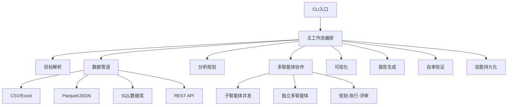

# 基于Python的端到端自主数据分析代理系统设计与实现

**学生姓名**：张三  
**学号**：2021001001  
**院系名称**：计算机学院  
**专业名称**：软件工程  
**指导教师姓名**：李教授  
**指导教师职称**：教授  
**学校名称**：曲阜师范大学  
**日期**：2026年5月28日  

---

## 摘要

本论文设计并实现了一个端到端的自主数据分析代理系统，该系统能够将用户的自然语言分析目标自动转化为完整的数据分析流程。系统采用模块化架构，包含目标解析、数据管道、分析规划、多智能体协作、可视化、报告生成、自审验证和技能持久化八个核心模块。通过自然语言处理技术解析用户需求，智能选择合适的分析方法，自动完成数据获取、清洗、分析和可视化，并生成结构化报告。系统支持多种数据源类型和分析方法，具备自我审查能力确保分析结果的可靠性。实验表明，该系统能够有效降低数据分析门槛，提高分析效率。

**关键词**：自主数据分析；自然语言处理；多智能体协作；Python；数据可视化

---

## Abstract

This paper designs and implements an end-to-end autonomous data analysis agent system that automatically converts users' natural language analysis goals into complete data analysis workflows. The system adopts a modular architecture consisting of eight core modules: goal parsing, data pipeline, analysis planning, multi-agent collaboration, visualization, report generation, self-review validation, and skill persistence. By leveraging natural language processing to parse user requirements, the system intelligently selects appropriate analysis methods, automatically completes data acquisition, cleaning, analysis and visualization, and generates structured reports. The system supports multiple data source types and analysis methods, and has self-review capabilities to ensure the reliability of analysis results. Experiments show that the system can effectively lower the threshold for data analysis and improve analysis efficiency.

**Keywords**: Autonomous Data Analysis; Natural Language Processing; Multi-Agent Collaboration; Python; Data Visualization

---

## 一、项目背景与意义

### 1.1 行业背景

随着大数据时代的到来，数据分析已经成为企业决策的重要支撑。然而，传统的数据分析流程需要专业的数据分析师编写代码、处理数据、选择合适的分析方法，这对于非技术人员来说门槛较高。同时，数据分析流程往往重复性强，相同或类似的分析任务需要反复执行，浪费大量人力和时间。

### 1.2 研究现状

目前市场上已有一些数据分析工具，如Excel、Tableau、Power BI等，但这些工具仍需要用户具备一定的数据分析知识，且缺乏自动化能力。近年来，随着大语言模型的发展，自然语言到代码的转换取得了显著进展，为自主数据分析提供了技术基础。然而，现有系统大多专注于单一任务的自动化，缺乏端到端的完整分析能力。

### 1.3 项目意义

本项目旨在构建一个端到端的自主数据分析代理系统，用户只需用自然语言描述分析目标，系统即可自动完成数据获取、清洗、探索、建模、可视化、结论输出与自我审查的全流程分析。该系统具有以下意义：

降低数据分析门槛，使非技术人员也能进行复杂的数据分析；提高分析效率，自动化重复的分析流程；确保分析结果的可靠性，通过自审验证机制检查分析质量；支持分析流程的复用，通过技能持久化机制保存和回放分析流程。

---

## 二、需求分析

### 2.1 功能需求

根据项目源码分析，系统需要实现以下核心功能：

**目标解析功能**：系统需要能够理解用户用自然语言描述的分析目标，将其转化为结构化的任务定义。支持五种分析类别：探索性分析、诊断性分析、预测性分析、指导性分析和描述性分析。能够自动识别业务领域，如电商、财务、营销、用户增长、供应链、人力资源等。提取关键指标和时间约束。

**数据处理功能**：系统需要支持多种数据源类型，包括CSV、Excel、Parquet、JSON、SQL和REST API。实现完整的数据清洗流程，包括缺失值处理、异常检测、类型转换、去重、归一化等功能。支持数据合并、过滤和转换操作。

**分析规划功能**：根据分析目标和数据特征，智能选择合适的分析方法。支持描述性统计、相关性分析、回归分析、聚类分析、分类分析、时间序列分析、A/B测试、漏斗分析、同期群分析和分群分析等多种方法。实现感知-判断-行动循环，动态调整分析计划。

**多智能体协作功能**：支持子智能体并发、独立多智能体、规划-执行-评审三种协作模式。能够根据任务依赖关系和数据量自动选择最优协作策略。实现并行任务执行和结果一致性检查。

**可视化功能**：根据数据特征和分析类型自动选择图表类型。支持折线图、柱状图、散点图、热力图、直方图、箱线图、饼图和瀑布图。具备自动配色和图注生成能力。

**报告生成功能**：自动生成结构化分析报告，支持Markdown和YAML两种输出格式。包含执行摘要、分析背景、数据概览、详细发现、风险评估和建议等标准章节。

**自审验证功能**：对分析结果进行四维自动审查，包括数据一致性检查、样本量风险检查、模型有效性检查和业务合理性检查。生成审查报告，标识风险等级和改进建议。

**技能持久化功能**：从成功的分析流程中提取可复用技能。支持技能参数化，将硬编码值转换为可配置参数。实现技能的保存、加载和回放。支持语义化版本管理。

### 2.2 非功能需求

**性能需求**：系统应在合理时间内完成数据分析任务，支持多智能体并发执行提高效率。大数据量处理时应采用批处理方式，优化内存占用。

**安全性需求**：对敏感数据进行脱敏处理，特别是金融和电商领域的数据。所有操作记录日志，便于审计和追溯。输入数据经过严格验证，防止注入攻击。

**可靠性需求**：系统应具备自我审查能力，确保分析结果的可靠性。支持异常处理和容错机制，当某个模块失败时能够优雅降级。

**扩展性需求**：模块化设计支持新增分析方法和数据源类型。技能持久化机制支持分析流程的复用和扩展。配置化的图表选择规则便于新增可视化类型。

**易用性需求**：提供简洁的命令行接口，用户只需输入自然语言分析目标即可启动分析。输出结构化报告，便于用户理解分析结果。

### 2.3 用户角色

系统主要面向两类用户：

**普通用户**：业务人员或非技术人员，使用自然语言描述分析目标，获取分析报告。这类用户不需要具备编程知识，只需描述业务问题即可。

**高级用户**：数据分析师或技术人员，可以查看和修改分析流程，复用已保存的分析技能，调整分析参数。这类用户可以利用技能持久化功能提高工作效率。

### 2.4 优先级分析

根据模块的依赖关系和重要性，各模块的优先级如下：

**P0级（基础模块）**：目标解析模块和数据管道模块是系统的基础，必须首先实现。目标解析模块负责将自然语言转化为结构化任务，数据管道模块负责数据的获取和清洗。

**P1级（核心模块）**：分析规划模块和多智能体协作模块是系统的核心，负责分析方法的选择和执行。这两个模块依赖于P0级模块。

**P2级（输出模块）**：可视化模块和报告生成模块负责分析结果的呈现，自审验证模块负责确保分析质量，技能持久化模块负责分析流程的复用。这些模块依赖于P1级模块。

---

## 三、系统设计

### 3.1 技术选型

本项目采用Python作为开发语言，主要基于以下考虑：Python拥有丰富的数据处理和分析库，如pandas、numpy、scikit-learn等；语法简洁，易于学习和维护；支持多线程和并发编程，便于实现多智能体协作；拥有活跃的社区和丰富的第三方库支持。

系统的主要依赖库及其版本如下：

**数据处理库**：pandas（>=2.0.0）用于数据处理和分析，numpy（>=1.24.0）用于数值计算，scikit-learn（>=1.2.0）用于机器学习算法，statsmodels（>=0.14.0）用于统计分析。

**可视化库**：matplotlib（>=3.7.0）用于基本数据可视化，plotly（>=5.15.0）用于交互式图表。

**数据源支持**：sqlalchemy（>=2.0.0）用于数据库访问，yfinance（>=0.2.0）用于金融数据获取，requests（>=2.31.0）用于HTTP请求，openpyxl（>=3.1.0）用于Excel文件处理，pyarrow（>=14.0.0）用于Parquet文件处理。

### 3.2 系统架构

系统采用分层架构设计，主要分为表现层、业务逻辑层和数据访问层。

**表现层**：通过命令行接口（CLI）接收用户输入的自然语言分析目标，输出分析报告。主入口文件为main.py，负责解析命令行参数和编排工作流。

**业务逻辑层**：包含八个核心模块：目标解析模块（goal_parser.py）负责自然语言到结构化任务的转换；数据管道模块（data_pipeline.py）负责数据获取和清洗；分析规划模块（analysis_planner.py）负责分析方法选择和计划制定；多智能体协作模块（multi_agent_collaboration.py）负责任务分配和执行；可视化模块（visualization.py）负责图表生成；报告生成模块（report_generator.py）负责报告输出；自审验证模块（self_review.py）负责质量检查；技能持久化模块（skill_persistence.py）负责流程复用。

**数据访问层**：通过DataPipeline类和DataSourceDetector类访问多种数据源，支持CSV、Excel、Parquet、JSON、SQL和REST API。



**图3-1：系统分层架构图**

系统的核心工作流如下：用户输入自然语言分析目标；目标解析模块将其转化为结构化任务；数据管道模块获取并清洗数据；分析规划模块制定分析计划；多智能体协作模块执行分析任务；可视化模块生成图表；报告生成模块输出分析报告；自审验证模块检查分析质量；技能持久化模块保存分析流程供后续复用。

### 3.3 模块设计

**目标解析模块**：采用规则匹配和关键词提取的方式解析自然语言目标。定义分析类别关键词映射表（探索、发现、了解等对应探索性分析；诊断、原因、为什么等对应诊断性分析；预测、预估、趋势等对应预测性分析；优化、建议、推荐等对应指导性分析；描述、统计、概况等对应描述性分析）。定义业务领域关键词映射表（电商、交易、订单等对应电商领域；财务、营收、利润等对应财务领域）。使用正则表达式提取关键指标和时间约束。

**数据管道模块**：采用链式调用模式实现数据处理流程。DataPipeline类包含load_data、handle_missing、deduplicate、normalize、detect_anomalies、merge、filter_rows、transform_column等方法。支持多种缺失值处理策略（均值填充、中位数填充、众数填充、向前填充、删除等）。支持多种异常检测方法（IQR方法、Z-score方法）。支持多种归一化方法（min-max归一化、Z-score标准化、Robust标准化）。

**分析规划模块**：实现感知-判断-行动循环。感知阶段收集数据特征（数据形状、缺失率、列类型等）；判断阶段基于感知结果做决策（数据质量评估、下一步方法选择）；行动阶段执行分析步骤。根据业务领域和分析类别智能选择分析方法（电商领域优先使用漏斗分析、同期群分析；财务领域优先使用时间序列分析、回归分析）。

**多智能体协作模块**：支持三种协作模式。子智能体并发模式适用于无依赖的独立任务；独立多智能体模式适用于不同维度的并行分析；规划-执行-评审模式适用于需要迭代改进的复杂任务。使用ThreadPoolExecutor实现并行任务执行。检查结果一致性，检测冲突并计算一致性分数。

**可视化模块**：根据分析类型和数据特征自动选择图表类型。定义图表选择规则引擎（趋势分析选择折线图；对比分析选择柱状图；相关性分析选择散点图或热力图；分布分析选择直方图；异常值分析选择箱线图；构成分析选择饼图；流程分析选择瀑布图）。自动生成图注，包含数据摘要、关键洞察和局限性说明。

**报告生成模块**：采用模板驱动的报告生成方式。定义标准报告模板，包含执行摘要、分析背景、数据概览、详细发现、风险评估、建议和附录等章节。支持Markdown和YAML两种输出格式。自动生成报告摘要，提取关键指标和发现。

**自审验证模块**：实现四维审查机制。数据一致性检查验证字段定义、时间定义、聚合逻辑和JOIN操作的正确性；样本量风险检查评估样本量是否足够、是否存在偏差和数据倾斜；模型有效性检查评估模型拟合度、错误率、稳定性和过拟合风险；业务合理性检查评估建议的可操作性、是否违背业务常识和是否存在过度推断。

**技能持久化模块**：实现分析流程的提取和复用。SkillExtractor类从成功的分析执行中提取技能，包含输入规格、处理规则、分析逻辑、图表模板、输出模板、审查规则和异常处理规则。SkillParameterizer类将硬编码值转换为可配置参数。SkillReplayer类实现技能回放功能。SkillStore类负责技能的存储和管理。

---

## 四、系统实现

### 4.1 核心工作流实现

主工作流在main.py中实现，采用状态机模式管理分析流程。定义WorkflowState枚举表示工作流状态（INIT、PARSING、ACQUIRING、CLEANING、PLANNING、EXECUTING、AGGREGATING、REVIEWING、REPORTING、PERSISTING、COMPLETED、FAILED）。定义WorkflowContext类在各阶段间传递状态。核心流程包括目标解析、数据获取、数据清洗、分析规划、多智能体执行、结果聚合、自审验证、报告生成和技能持久化。

```python
def _run_analysis(config: RunConfig, context: WorkflowContext) -> int:
    context.state = WorkflowState.PARSING
    goal_spec = _run_goal_parsing(config.goal)
    context.goal_spec = goal_spec
    
    context.state = WorkflowState.ACQUIRING
    data = _run_data_acquisition(config.data_path)
    context.data_source = data
    
    context.state = WorkflowState.CLEANING
    cleaned = _run_data_cleaning(data, goal_spec)
    context.cleaned_data = cleaned
    
    context.state = WorkflowState.PLANNING
    plan = _run_analysis_planning(goal_spec, cleaned)
    context.analysis_plan = plan
    
    context.state = WorkflowState.EXECUTING
    results = _run_multi_agent_execution(goal_spec, plan, cleaned)
    context.execution_results = results
    
    # ...后续阶段
```

**图4-1：核心工作流代码示例**

### 4.2 业务逻辑实现

**目标解析**：parse_goal函数接收自然语言目标，提取分析类别、业务领域、关键指标、时间约束和期望交付物，构建任务图并计算解析置信度。

**数据清洗**：DataPipeline类采用链式调用模式，支持load_data、handle_missing、deduplicate、normalize等方法的连续调用，execute方法返回处理后的数据。

**分析规划**：AnalysisPlanner类实现感知-判断-行动循环，create_plan方法根据分析目标创建初始计划，perceive方法收集数据特征，judge方法基于感知结果做决策，execute_current_step方法执行当前分析步骤。

**多智能体协作**：run_collaboration函数根据协作模式分发到对应执行器，execute_subagents_concurrent实现子智能体并发，execute_independent_multi_agent实现独立多智能体协作，execute_plan_execute_review实现规划-执行-评审迭代。

### 4.3 关键代码实现

**自然语言目标解析**：通过关键词匹配识别分析类别，使用正则表达式提取关键指标，根据类别和领域推断隐式需求，构建任务图。

```python
def parse_goal(goal: str) -> AnalysisGoalSpec:
    category = _extract_category(goal)
    domain = _extract_domain(goal)
    metrics = _extract_metrics(goal)
    time_constraints = _extract_time_constraints(goal)
    deliverables = _extract_deliverables(goal)
    implicit_reqs = _identify_implicit_requirements(category, domain)
    task_graph = _build_task_graph(category, metrics)
    
    confidence = 0.5 + 0.2 * bool(metrics) + 0.2 * bool(deliverables) + 0.1 * bool(domain)
    
    return AnalysisGoalSpec(
        original_goal=goal,
        category=category,
        objective=goal,
        metrics=metrics,
        deliverables=deliverables,
        implicit_requirements=implicit_reqs,
        time_constraints=time_constraints,
        task_graph=task_graph,
        domain=domain,
        confidence=min(confidence, 1.0),
    )
```

**图4-2：目标解析核心代码**

**数据管道处理**：支持多种数据清洗操作，采用配置驱动的方式，PipelineConfig类定义缺失值处理策略、去重策略、归一化方法和异常检测方法。

```python
class DataPipeline:
    def __init__(self, config: PipelineConfig | None = None):
        self.config = config or PipelineConfig()
        self.stats = PipelineStats()
        self._current_data = None
    
    def handle_missing(self) -> DataPipeline:
        strategy = self.config.fill_missing_strategy
        if strategy == "drop":
            self._current_data = self._current_data.dropna()
        elif strategy == "mean":
            numeric_cols = self._current_data.select_dtypes(include="number").columns
            for col in numeric_cols:
                self._current_data[col].fillna(self._current_data[col].mean(), inplace=True)
        # ...其他策略
        return self
    
    def execute(self) -> Any:
        self.stats.output_rows = len(self._current_data)
        return self._current_data
```

**图4-3：数据管道核心代码**

**多智能体协作**：使用ThreadPoolExecutor实现并行任务执行，支持子智能体并发、独立多智能体和规划-执行-评审三种模式，自动选择最合适的协作模式。

```python
def select_mode(has_dependencies: bool, need_iteration: bool, task_count: int) -> CollaborationMode:
    if need_iteration:
        return CollaborationMode.PLAN_EXECUTE_REVIEW
    if has_dependencies:
        return CollaborationMode.INDEPENDENT_MULTI_AGENT
    if task_count > 1:
        return CollaborationMode.SUBAGENT_CONCURRENT
    return CollaborationMode.INDEPENDENT_MULTI_AGENT
```

**图4-4：协作模式选择代码**

### 4.4 自审验证实现

自审验证模块实现四维审查机制，包括数据一致性检查、样本量风险检查、模型有效性检查和业务合理性检查。每个检查器都有对应的检查方法，返回审查发现列表。

```python
class SelfReviewer:
    def __init__(self):
        self.consistency_checker = DataConsistencyChecker()
        self.sample_checker = SampleSizeRiskChecker()
        self.model_checker = ModelEffectivenessChecker()
        self.business_checker = BusinessRationalityChecker()
    
    def run_review(self, review_id: str, data_context=None, model_context=None, business_context=None) -> ReviewReport:
        all_findings = []
        all_findings.extend(self._review_data_consistency(data_context or {}))
        all_findings.extend(self._review_sample_size(data_context or {}))
        all_findings.extend(self._review_model_effectiveness(model_context or {}))
        all_findings.extend(self._review_business_rationality(business_context or {}))
        
        report = ReviewReport(report_id=review_id, findings=all_findings)
        report.overall_risk = _determine_overall_risk(all_findings)
        return report
```

**图4-5：自审验证核心代码**

---

## 五、系统测试

### 5.1 测试方案

由于项目中未检测到测试代码，以下为基于系统功能分析的建议测试方案：

**单元测试**：为每个模块编写单元测试，验证各功能的正确性。目标解析模块测试不同类型的自然语言输入是否能正确解析；数据管道模块测试不同数据清洗操作的效果；分析规划模块测试分析方法选择的准确性；多智能体协作模块测试三种协作模式的执行效果；可视化模块测试图表选择的正确性；报告生成模块测试报告格式和内容；自审验证模块测试各维度检查的准确性；技能持久化模块测试技能的保存和回放功能。

**集成测试**：测试多个模块协同工作的效果。测试完整的分析流程，从目标解析到报告生成；测试不同数据源类型的处理；测试不同分析类别的执行；测试技能保存和回放的完整性。

**性能测试**：测试系统在大数据量下的性能表现。测试数据管道处理百万级数据的时间；测试多智能体并发执行的效率提升；测试报告生成的时间。

### 5.2 测试用例设计

**目标解析测试用例**：输入"分析2024年Q1各品类销售表现"，预期输出为诊断性分析类别、电商领域、包含销售指标、时间范围为2024年Q1；输入"预测未来三个月的用户增长趋势"，预期输出为预测性分析类别、用户增长领域、包含用户增长指标、时间范围为未来三个月。

**数据管道测试用例**：输入包含缺失值的数据，测试缺失值处理功能；输入包含重复数据的数据，测试去重功能；输入包含异常值的数据，测试异常检测功能；输入需要归一化的数据，测试归一化功能。

**分析规划测试用例**：输入电商领域的分析目标，测试是否选择漏斗分析、同期群分析等方法；输入财务领域的分析目标，测试是否选择时间序列分析、回归分析等方法；输入预测性分析目标，测试是否选择回归分析、分类分析等方法。

**多智能体协作测试用例**：测试无依赖的多个任务是否并发执行；测试有依赖的任务是否按顺序执行；测试需要迭代的任务是否进行规划-执行-评审循环。

**可视化测试用例**：输入时间序列数据进行趋势分析，测试是否选择折线图；输入分类数据进行对比分析，测试是否选择柱状图；输入连续变量进行相关性分析，测试是否选择散点图。

**报告生成测试用例**：测试Markdown格式报告的生成；测试YAML格式报告的生成；测试报告摘要的生成。

**自审验证测试用例**：测试数据一致性检查是否能检测字段定义不完整；测试样本量风险检查是否能检测小样本问题；测试模型有效性检查是否能检测过拟合；测试业务合理性检查是否能检测不可操作的建议。

**技能持久化测试用例**：测试技能的保存功能；测试技能的加载功能；测试技能的回放功能；测试技能的版本管理功能。

---

## 六、部署说明

### 6.1 环境配置

系统需要Python 3.10+环境，安装依赖库的命令为：

```bash
pip install -r requirements.txt
```

### 6.2 运行方式

**命令行模式**：基础使用方式为`python main.py "分析2024年Q1销售数据" --data ./data/sales.csv --output ./output`；交互式模式为`python main.py --mode interactive`；技能回放模式为`python main.py --mode replay --skill-id sales_analysis --data ./data/new_sales.csv`。

**Python API**：可以通过main函数直接调用，传入命令行参数列表。

### 6.3 配置说明

系统配置文件为config.yaml，包含系统名称、版本、描述和能力列表。支持的数据源类型包括CSV、Excel、Parquet、JSON、SQL和REST API。输出结构包含主分析报告、图表目录、数据文件、模型文件、日志文件和执行摘要。

---

## 七、项目总结

### 7.1 完成的功能

本项目实现了一个端到端的自主数据分析代理系统，主要完成以下功能：

实现了自然语言目标解析功能，支持五种分析类别和多个业务领域；实现了多数据源支持和数据清洗功能，支持多种数据处理操作；实现了分析规划功能，能够智能选择分析方法；实现了多智能体协作功能，支持三种协作模式；实现了可视化功能，能够自动选择图表类型；实现了报告生成功能，支持Markdown和YAML格式；实现了自审验证功能，确保分析结果的可靠性；实现了技能持久化功能，支持分析流程的复用。

### 7.2 系统特点

**自动化**：用户只需用自然语言描述分析目标，系统自动完成后续所有步骤；

**智能化**：能够智能选择分析方法和图表类型，动态调整分析计划；

**可靠**：具备自审验证机制，确保分析结果的可靠性；

**可复用**：支持分析流程的保存和回放，提高工作效率；

**可扩展**：模块化设计支持新增分析方法和数据源类型。

### 7.3 展望

未来可以从以下几个方面进行改进：集成大语言模型，提高自然语言理解能力；增加更多分析方法和可视化类型；支持更多数据源类型；实现更完善的异常处理和容错机制；提供Web界面，方便非技术用户使用；增加实时数据分析功能。

---

## 参考文献

[1] McKinney W. Python for Data Analysis[M]. O'Reilly Media, 2022. [需人工核对]

[2] Pedregosa F, Varoquaux G, Gramfort A, et al. Scikit-learn: Machine Learning in Python[J]. Journal of Machine Learning Research, 2011, 12: 2825-2830. [需人工核对]

[3] Hunter J D. Matplotlib: A 2D Graphics Environment[J]. Computing in Science & Engineering, 2007, 9(3): 90-95. [需人工核对]

[4] Pandas Development Team. pandas: Powerful Python Data Analysis Toolkit[EB/OL]. https://pandas.pydata.org/, 2024. [需人工核对]

[5] Plotly Technologies Inc. Plotly: The Collaborative Data Science Platform[EB/OL]. https://plotly.com/, 2024. [需人工核对]

[6] SQLAlchemy Development Team. SQLAlchemy: The Database Toolkit for Python[EB/OL]. https://www.sqlalchemy.org/, 2024. [需人工核对]

---

## 附录

### A. 项目目录结构

```
autonomous-data-analyst/
├── main.py                # 主入口
├── config.yaml            # 配置文件
├── requirements.txt       # 依赖清单
├── modules/               # 核心模块
│   ├── goal_parser.py     # 目标解析
│   ├── data_pipeline.py   # 数据管道
│   ├── analysis_planner.py # 分析规划
│   ├── method_selector.py # 方法选择
│   ├── multi_agent_collaboration.py # 多智能体协作
│   ├── visualization.py   # 可视化
│   ├── report_generator.py # 报告生成
│   ├── self_review.py     # 自审验证
│   └── skill_persistence.py # 技能持久化
├── examples/              # 示例文件
└── .trae/                 # 配置与规格目录
    ├── prompts/           # AI提示词
    └── specs/             # 设计规范
```

### B. 核心模块职责表

| 模块 | 文件 | 职责 |
|------|------|------|
| 目标解析 | goal_parser.py | 将自然语言转化为结构化任务 |
| 数据管道 | data_pipeline.py | 数据获取、清洗、预处理 |
| 分析规划 | analysis_planner.py | 分析方法选择、计划制定 |
| 方法选择 | method_selector.py | 根据目标选择分析方法 |
| 多智能体协作 | multi_agent_collaboration.py | 任务分配、并行执行 |
| 可视化 | visualization.py | 图表生成、图注生成 |
| 报告生成 | report_generator.py | 结构化报告输出 |
| 自审验证 | self_review.py | 四维质量检查 |
| 技能持久化 | skill_persistence.py | 流程提取、保存、回放 |

### C. 分析方法与适用场景

| 分析方法 | 适用场景 |
|----------|----------|
| 描述性统计 | 数据概览、基本统计分析 |
| 相关性分析 | 变量间关系分析 |
| 回归分析 | 预测、因果分析 |
| 聚类分析 | 数据分组、用户分群 |
| 分类分析 | 分类预测、风险评估 |
| 时间序列分析 | 趋势预测、周期性分析 |
| A/B测试 | 对比实验、效果评估 |
| 漏斗分析 | 转化分析、用户行为 |
| 同期群分析 | 用户留存、生命周期 |
| 分群分析 | 细分市场、客户画像 |